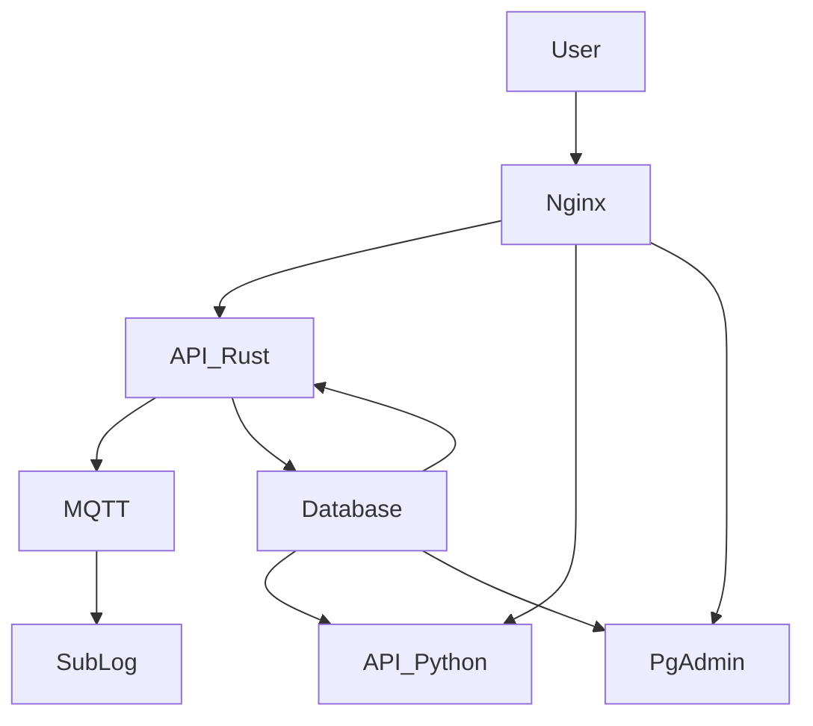

# Dead Poet Society

### Florian "FloRide" REIMAT

## About

This is an Epita project, for the classes of "Service-oriented architectures", it's designed as an microservice system.
The requirements were:

- 2 API
  - One in Python aimed to only fetch data from the database
  - One in the user choosen language (i choose Rust), aimed to add, edit and delete data.
- 1 "PubSub" system, link to the API (i choose MQTT with mosquitto)
- 1 submodule using the "PubSub" system (i created a simple sublog module)
- The use of Keycloak as the OpenAuth system
- The use of an reverse-proxy as the main gateway (i choose nginx)

The project is aimed to represent a simple social networks for poet. (Based on the [Dead Poet Society](https://en.wikipedia.org/wiki/Dead_Poets_Society) movie)

## How to install / launch it

```sh
git clone https://github.com/FloRide1/dead_poet_society.git

# Generate .env file
cp .env.default .env

# Create cert folder in nginx
mkdir -p ./nginx/cert
# Generate self-signed SSL key (don't use for production)
openssl req -x509 -nodes -days 365 -newkey rsa:2048 -keyout ./nginx/cert/nginx.priv.pem -out ./nginx/cert/nginx.pub.pem

docker-compose up -d
```

Please don't forget to setup the env file before launching the docker-compose.
The default .env file is this one [.env.default](./.env.default).

## Architecture



## Documentation

- OpenAPI:
  - Download / Copy [open-api.yml](./misc/open-api.yml)
  - Use it on [swagger.io](https://editor.swagger.io)
