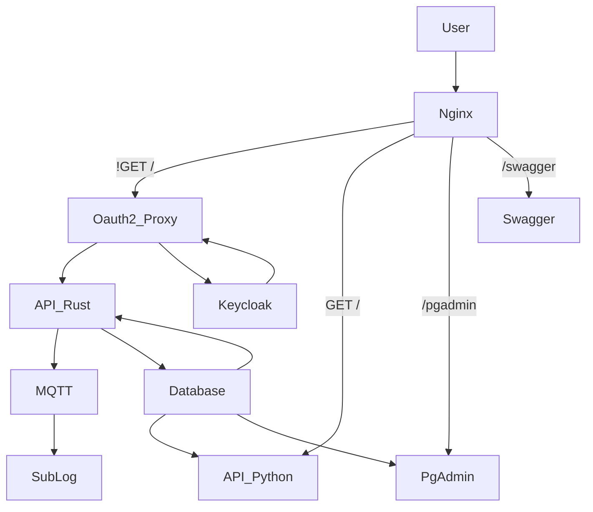

# Dead Poet Society

### Florian "FloRide" REIMAT

## About

This is an Epita project, for the classes of "Service-oriented architectures", it's designed as an microservice system.
The requirements were:

- 2 API
  - One in Python aimed to only fetch data from the database
  - One in the user choosen language (i choose Rust), aimed to add, edit and delete data.
- 1 "PubSub" system, link to the API (i choose MQTT with mosquitto)
- 1 submodule using the "PubSub" system (i created a simple sublog module)
- The use of Keycloak as the OpenAuth system
- The use of an reverse-proxy as the main gateway (i choose nginx)

The project is aimed to represent a simple social networks for poet. (Based on the [Dead Poet Society](https://en.wikipedia.org/wiki/Dead_Poets_Society) movie)

## How to install / launch it

- Add dps.epita.local as an host for localhost
```sh
echo "127.0.0.1 dps.epita.local" >> /etc/hosts

# or else just change the GLOBAL_DOMAIN variable
``` 

- Clone + Launch the project
```sh
# Clone the project
git clone https://github.com/FloRide1/dead_poet_society.git

# Go to the dead_poet_society folder
cd dead_poet_society

# Generate .env file
cp .env.default .env

# Generate self-signed SSL key (don't use for production)
openssl req -x509 -newkey rsa:4096 -keyout ./nginx/cert/key.pem -out ./nginx/cert/cert.pem -days 365 -nodes -config ./nginx/cert/app.config

# Launch docker
docker-compose up -d
```

- Go to the [Admin page](https://dps.epita.local/auth/admin)
- Login with `$KEYCLOAK_USER` (admin) `$KEYCLOAK_PASSWORD` (admin)
- Copy Client "oauth2_proxy" Credentials Secret
- Set it in [.env](./.env.default) to `$OAUTH2_PROXY_CLIENT_SECRET` variable

- Just restart docker (stop and start and not restart)
```sh
# Stop docker
docker-compose stop

# Restart docker
docker-compose up -d
```

- Now for every User that need to have access of the API, simply add the "**api-role**" Role to this User

## Architecture



## Documentation

- Endpoints:
    I will assume that you use dps.epita.local as your `$GLOBAL_DOMAIN`
    - Open-Api: https://dps.epita.local/swagger
    - Login: https://dps.epita.local/login
    - Logout: https://dps.epita.local/logout
    - Admin: https://dps.epita.local/auth/admin
    - PgAdmin: https://dps.epita.local/pgadmin
